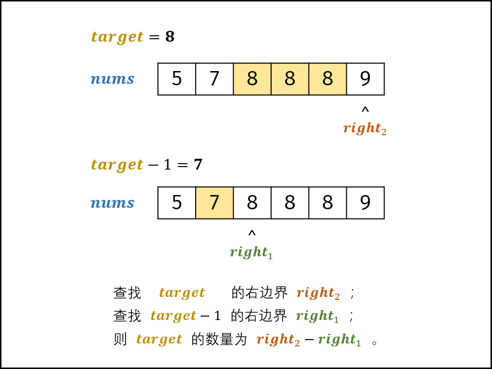

> [Python3 字典 | 菜鸟教程 (runoob.com)](https://www.runoob.com/python3/python3-dictionary.html)

Python 字典 setdefault() 方法和 [get()方法](https://www.runoob.com/python3/python3-att-dictionary-get.html) 类似, 如果键不存在于字典中，将会添加键并将值设为默认值。

#### 语法

setdefault()方法语法：

```
dict.setdefault(key, default=None)
```


### 数组中重复的数字

方法1：

哈希表，一一映射，添加次数为2，则马上返回

方法2：原地交换

利用数组长度n大于数组元素 0 ~ n-1

将索引和value值，一一对应，往下遍历，遇到重复值时，进行返回

方法3：

数组排序，然后两两比较


#### 在排序数组中查找数字 I

> [剑指 Offer 53 - I. 在排序数组中查找数字 I - 力扣（Leetcode）](https://leetcode.cn/problems/zai-pai-xu-shu-zu-zhong-cha-zhao-shu-zi-lcof/solutions/155893/mian-shi-ti-53-i-zai-pai-xu-shu-zu-zhong-cha-zha-5/?orderBy=hot)



寻求右边界，j + 1大于tar，结束终止于 i = j 时，再根据条件tar进行判断，小于等于tar, i = m + 1

若大于tar，则 i = m

宗旨为计算其右边界

```python
class Solution:
    def search(self, nums: [int], target: int) -> int:
        def helper(tar):
            i, j = 0, len(nums) - 1
            while i <= j:
                m = (i + j) // 2
                if nums[m] <= tar: i = m + 1
                else: j = m - 1
            return i
        return helper(target) - helper(target - 1)
```

#### 0～n-1中缺失的数字

> [剑指 Offer 53 - II. 0～n-1中缺失的数字 - 力扣（Leetcode）](https://leetcode.cn/problems/que-shi-de-shu-zi-lcof/solutions/155915/mian-shi-ti-53-ii-0n-1zhong-que-shi-de-shu-zi-er-f/)

二分法 target

+ 双索引 i 和 j

  + 左边界 i

  + 右边界 j

+ 循环(i <= j)，结束条件：i > j

  + 中点：向下取整 $m = (i + j) // 2$
  + 如果 中点小于等于 target，i = m + 1 ，右子数组的首位元素一定在闭区间 $ [m + 1, j]$  中，（大于target的首元素）
  + 如果 中点等于 target, return i(对于target在数组中)
  + 否则(中点大于 target)：j = m - 1， （左子数组的末位元素 一定在闭区间$[i, m - 1] $中）

+ 跳出时，变量 *i* 和 *j* 分别指向 “右子数组的首位元素” 和 “左子数组的末位元素” 。因此返回 ii*i* 即可。

  + 右子数组的首位元素  i
  + 左子数组的末位元素 j

+ 如果 target 不在数组中，那么临界条件是 i = j，判断一次得到结果


